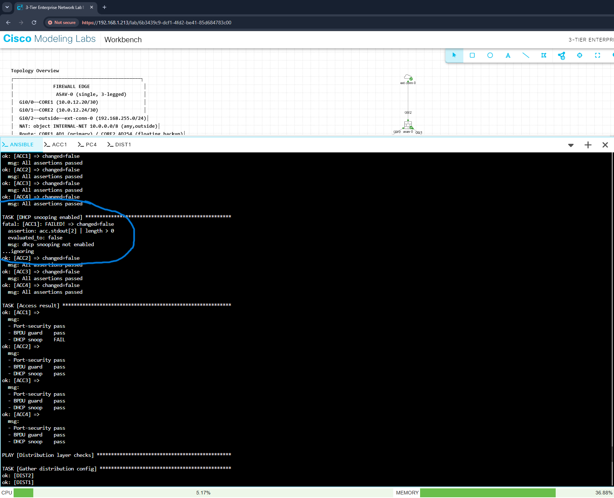
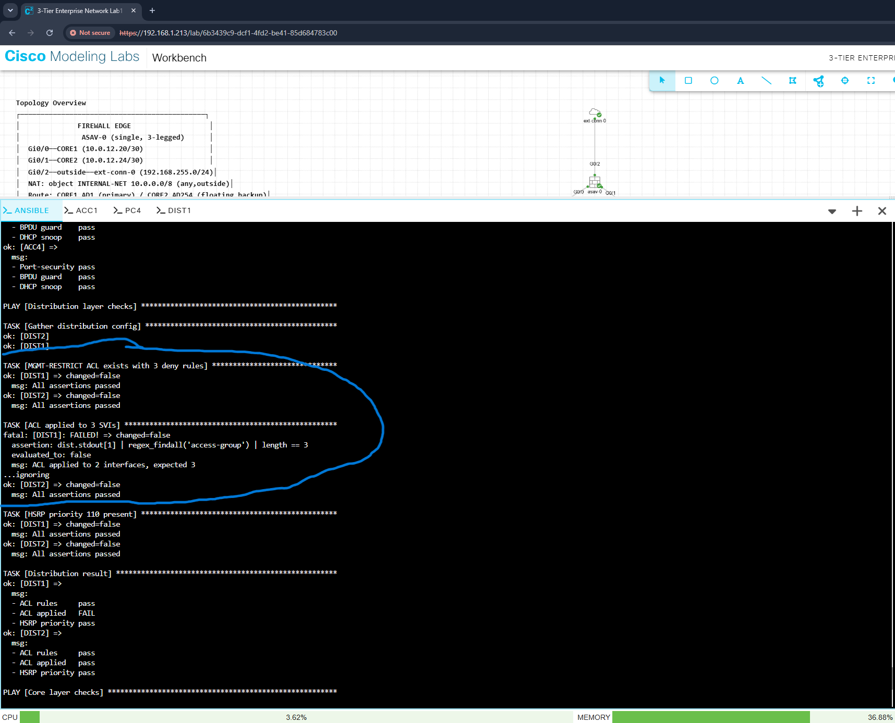

# Compliance Checking

Config backup answers *what changed*. Compliance checking answers a different question: *is the network in the state it is supposed to be in?*

Those are not the same, and the gap between them is where silent failures live. A playbook can report success and leave devices untouched — that happened on this network, and it is what motivated building this.

---

## 1. Design — checks scoped by layer

Compliance rules differ by device role. Access switches need port-security and DHCP snooping; core routers do not. Distribution switches carry the `MGMT-RESTRICT` ACL; nothing else does.

Two ways to express that: conditionals on every task (`when: inventory_hostname in groups['access']`), or separate plays targeting each group. This uses separate plays — it reads more clearly, and it mirrors how the rules are actually reasoned about.

```
Play 1  hosts: ios            baseline security, all devices
Play 2  hosts: access         port-security, BPDU guard, DHCP snooping
Play 3  hosts: distribution   ACL rules, ACL application, HSRP priority
Play 4  hosts: core           OSPF process, neighbour state
```

Twelve checks total. A device is only asked about config it is supposed to have.

---

## 2. Checks

| Layer | Check | What it verifies |
|---|---|---|
| All | NTP configured | `ntp server` present |
| All | Telnet disabled | `transport input` excludes telnet |
| All | Enable secret set | `enable secret` present, not plain `enable password` |
| All | Password encryption | `service password-encryption` present |
| All | SSH version 2 | operational state via `show ip ssh` |
| Access | Port-security | enabled on host-facing ports |
| Access | BPDU guard | configured |
| Access | DHCP snooping | globally enabled |
| Distribution | ACL rule count | `MGMT-RESTRICT` has exactly 3 deny rules |
| Distribution | ACL application | applied inbound on exactly 3 SVIs |
| Distribution | HSRP priority | priority 110 present — switch is active for some VLAN |
| Core | OSPF process | `router ospf` configured |
| Core | Neighbour state | no adjacency stuck in EXSTART or INIT |

---

## 3. Mechanism

Three pieces make a compliance report work rather than just a series of pass/fail tasks.

**`ignore_errors: true`** — an `assert` failure normally removes that host from the rest of the play. In a compliance run that is wrong: one failed check would hide every subsequent one on that device. With `ignore_errors`, the failure is recorded and the device continues.

**`register` on the assert** — captures whether it passed, so results can be summarised rather than only printed.

```yaml
- name: DHCP snooping enabled
  ansible.builtin.assert:
    that: acc.stdout[2] | length > 0
    fail_msg: "dhcp snooping not enabled"
  register: c_snoop
  ignore_errors: true
```

**Batched commands** — one `ios_command` task issues several `show` commands, indexed as `stdout[0]`, `stdout[1]` and so on. Far fewer SSH round-trips than one task per check.

---

## 4. Counting, not just presence

Presence checks are weak. `MGMT-RESTRICT` existing says nothing about whether it still contains the rules it should:

```yaml
that: dist.stdout[0] | regex_findall('deny') | length == 3
fail_msg: "expected 3 deny rules, found {{ dist.stdout[0] | regex_findall('deny') | length }}"
```

`regex_findall` returns every match as a list; `| length` counts them. Someone could delete two of three deny rules and a presence check would still pass. This one fails, and the message names the actual count.

Same approach for ACL application — the check asserts three interfaces, not "at least one".

---

## 5. Config checks vs state checks

The first version of the SSH check read the running-config:

```yaml
- show running-config | include ^ip ssh version
```

It failed on all six switches and passed on both routers. The switches were fine — SSH v2 was running, confirmed with `show ip ssh`. On the `ioll2-xe` images SSH v2 is the default, so the line does not appear in running-config even when active. The `csr1000v` routers store it explicitly.

The check was asking the wrong question: it tested **configuration** when it should have tested **state**.

Fixed by querying operational state instead:

```yaml
- show ip ssh
...
that: "'version 2' in base.stdout[4]"
```

**Config checks** suit anything that must be explicitly set — an ACL, an NTP server, `service password-encryption`. **State checks** are needed where a default achieves the goal without appearing in config, or where config and reality can diverge: an interface configured `no shutdown` but physically down, OSPF configured with no neighbours.

Getting this wrong produces false positives, and a compliance system that cries wolf is worse than none — it trains people to ignore it.

---

## 6. Findings

The first full run found a genuine gap: **`service password-encryption` was missing on all eight devices**. It was specified in the original build document and never applied. Fixed with a small remediation playbook:

```yaml
- name: Set service password-encryption
  cisco.ios.ios_config:
    lines:
      - service password-encryption
    save_when: modified
```

An earlier run had already found six devices with no NTP configuration despite a `configure_ntp.yml` run that reported complete success.

---

## 7. Validating the checks themselves

A compliance suite that has never failed cannot be trusted — an all-green report is equally consistent with checks that always pass.

Two faults were introduced deliberately:

```
ACC1(config)#  no ip dhcp snooping
DIST1(config)# interface vlan 20
DIST1(config-if)# no ip access-group MGMT-RESTRICT in
```

Both were caught, on the correct devices, with no false positives elsewhere:





```
ACC1   DHCP snoop   FAIL   dhcp snooping not enabled
DIST1  ACL applied  FAIL   ACL applied to 2 interfaces, expected 3
```

The second message is the point of counting rather than checking presence — it reports not just that something is wrong, but what the actual value was.

Both faults were then reverted and the suite returned to all-green.

---

## 8. Where this sits

| Playbook | Question it answers |
|---|---|
| `backup_and_commit.yml` | What changed, and when? |
| `check_compliance.yml` | Is the network in its intended state? |
| `configure_ntp.yml` | Bring it back into state |

Detect, verify, remediate. Each was built because the previous one exposed a gap.
